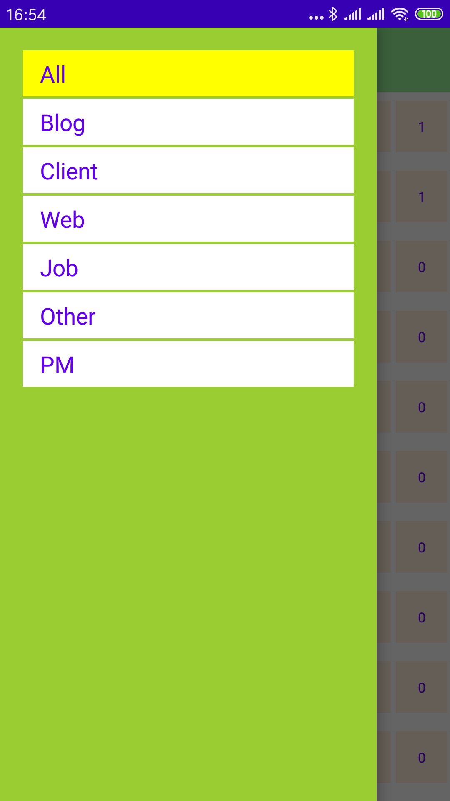
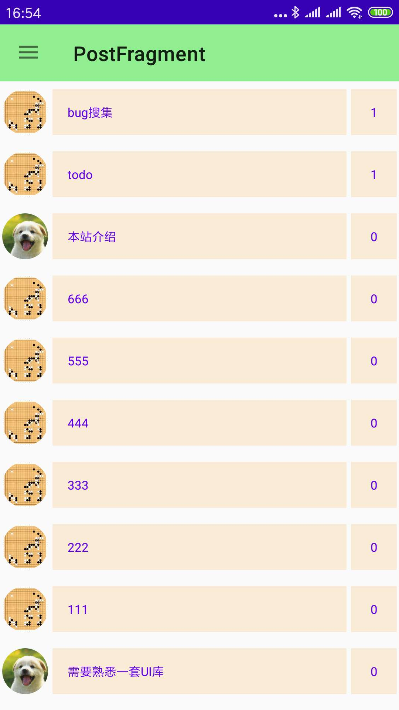
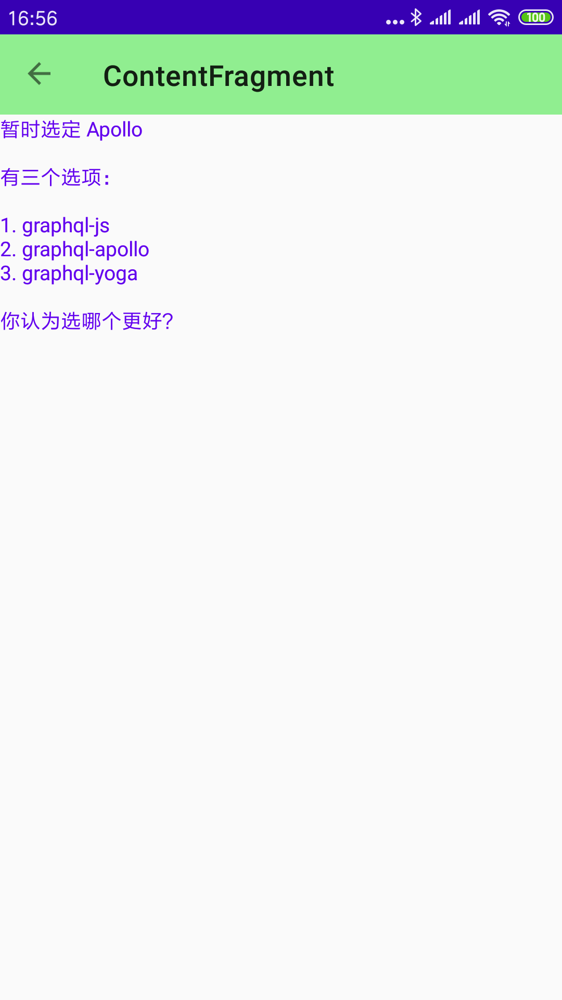
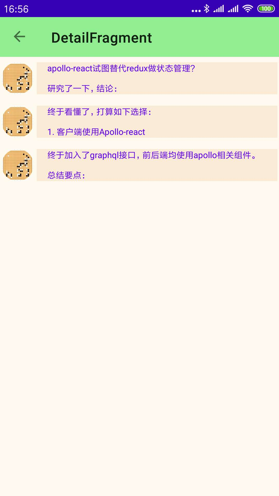

# purebbs-android
android client using "jetpack+kotlin"

used:

- Data-binding
- Navigation
- Coroutine
- Paging
- ViewModel
- LiveData
- Room
- Retrofit+OkHttp
- KTX

todo:

frontend repo:
- [frontend](https://github.com/maxyou/purebbs)

server repo:
- [server](https://github.com/maxyou/purebbs-server)

## Screen

## License 
under [MIT License](http://www.opensource.org/licenses/MIT).
